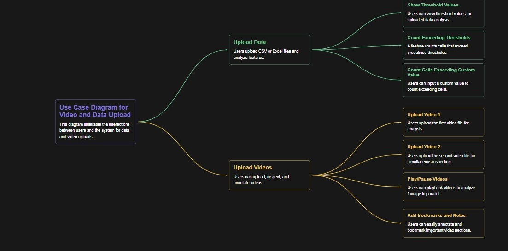
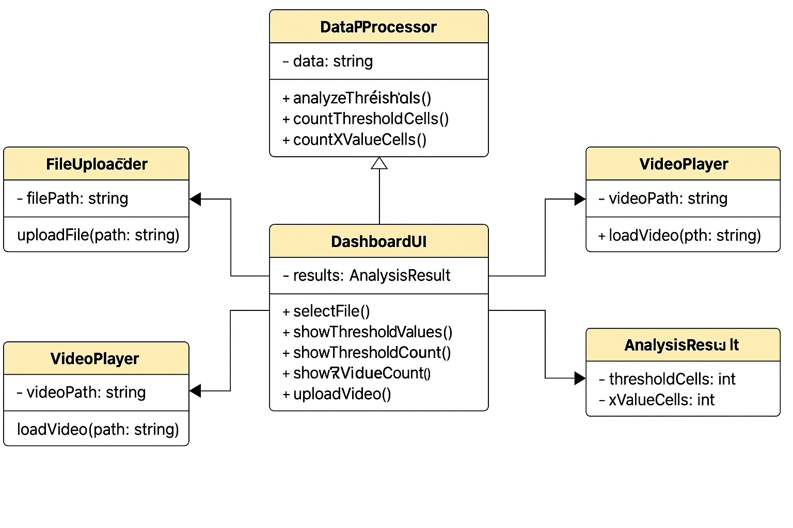
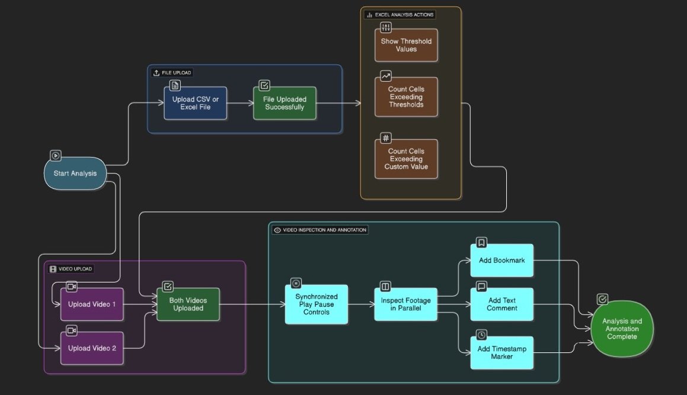

 # 🛣️ Design Document: NHAI Inspection Dashboard

## 1. Overview

The NHAI Inspection Dashboard is a **web-based tool** designed to assist engineers and analysts in:
- Visualizing and analyzing Excel data (`.csv` / `.xlsx`)
- Synchronized video footage comparisons from road inspections

The tool supports key spreadsheet analysis operations and **side-by-side video comparison** for effective, informed decision-making.

  
---

## 2. Features

- 📂 Upload and parse Excel files (`.csv`, `.xlsx`)
- 📈 Analyze data using **predefined thresholds**
- 🔢 Highlight cells exceeding:
  - Hard-coded threshold values
  - User-defined custom 'X' values
- 🎥 Upload and play two videos in **parallel with synchronized controls**
- 🧮 Clean dashboard UI with:
  - File input components
  - Action buttons for analysis
  - Real-time result display

---

## 3. Architecture

The app uses a **client-side architecture** built with **ReactJS**.

### 🔧 Key Technologies
- **JavaScript FileReader** API for local file handling
- **SheetJS (XLSX)** for spreadsheet parsing
- **HTML5 Video Elements** for video playback
- **React Hooks** to manage video synchronization and state

  

---

## 4. Component Structure

| Component         | Responsibility                                         |
|-------------------|--------------------------------------------------------|
| `App`             | Root component containing global logic and layout      |
| `FileUploaders`   | Separate uploaders for Excel, Video 1, and Video 2     |
| `AnalysisButtons` | Button group to trigger computations                   |
| `ResultDisplay`   | Renders analyzed output from spreadsheet               |
| `VideoPlayers`    | Synchronized dual video view with controls             |
| `BookmarksNotes`  | *(Planned)* Allow bookmarks/notes on video timestamps  |

 
--

## 5. Styling and UI Design

The project uses **vanilla CSS only** (`App.css`, `index.css`) — no utility frameworks like Tailwind.

### 🎨 Visual Styling
- **Navy blue header** for contrast and branding
- **Light yellow background** for eye comfort
- **Blue-themed buttons** for consistency
- **Centered card layout** for all modules

---

## 6. Future Improvements

- 🔐 Add **user authentication**
- 🗺️ Integrate **map-based route overlays**
- 💾 Export analyzed reports as downloadable files
- 🧠 Improve threshold customization with advanced filters

---

